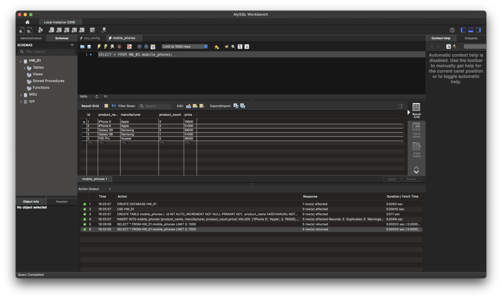
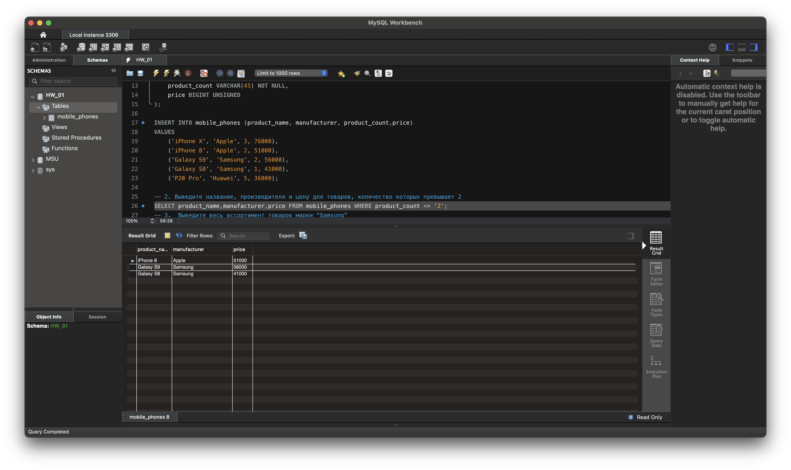
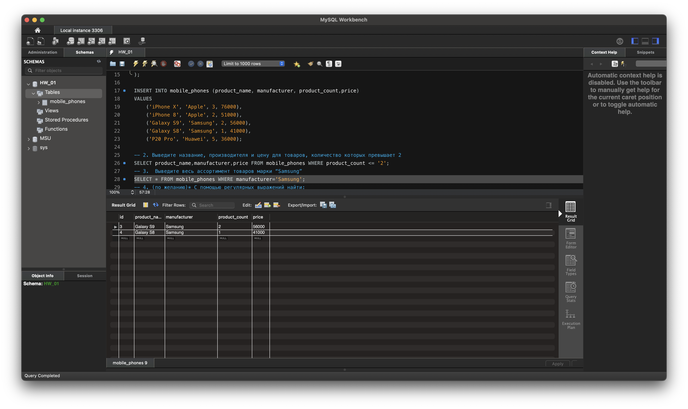
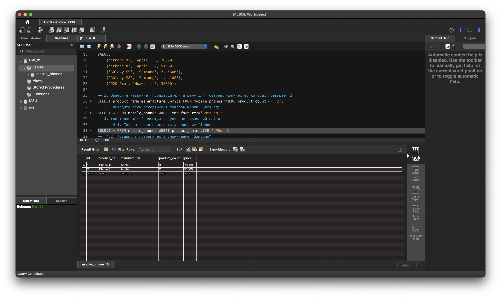
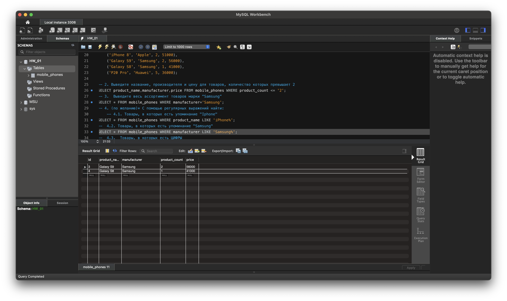
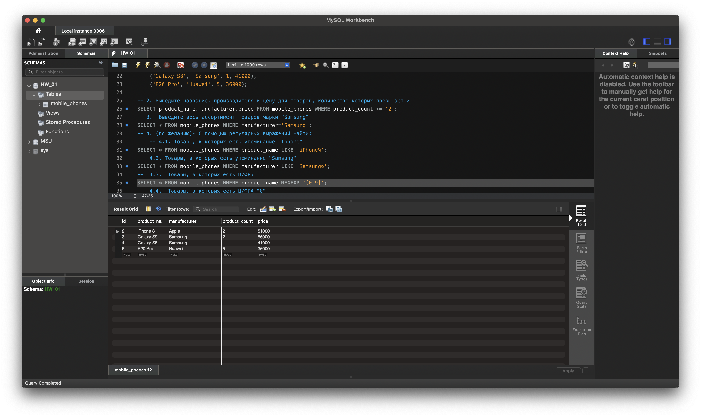
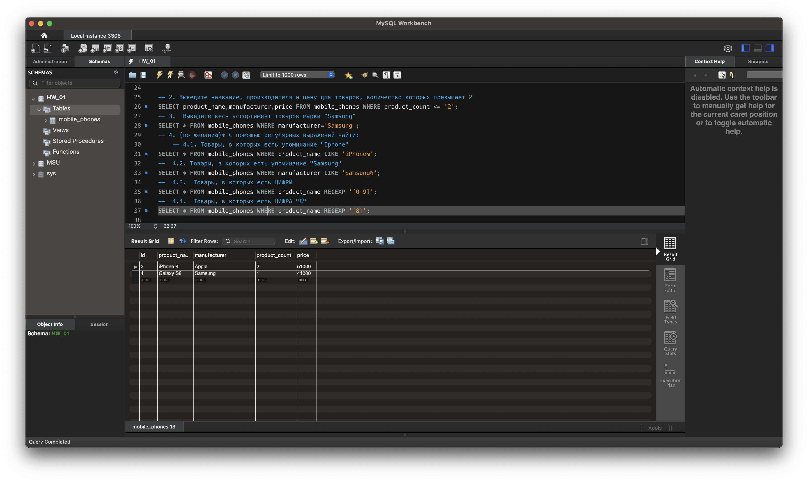

-- 1. Создайте таблицу с мобильными телефонами (mobile_phones), 
-- используя графический интерфейс. Заполните БД данными . 
-- Добавьте скриншот на платформу в качестве ответа на ДЗ 

CREATE DATABASE HW_01; 
USE HW_01; 

CREATE TABLE mobile_phones 
( 
	id INT AUTO_INCREMENT NOT NULL PRIMARY KEY, 
	product_name VARCHAR(45) NOT NULL, 
	manufacturer VARCHAR(45) NOT NULL, 
	product_count VARCHAR(45) NOT NULL, 
	price BIGINT UNSIGNED 
); 

INSERT INTO mobile_phones (product_name, manufacturer, product_count,price) 
VALUES 
	('iPhone X', 'Apple', 3, 76000), 
	('iPhone 8', 'Apple', 2, 51000), 
	('Galaxy S9', 'Samsung', 2, 56000), 
	('Galaxy S8', 'Samsung', 1, 41000), 
	('P20 Pro', 'Huawei', 5, 36000); 

    
-- 2. Выведите название, производителя и цену для товаров, количество которых превышает 2 
SELECT product_name,manufacturer,price FROM mobile_phones WHERE product_count <= '2'; 

-- 3.  Выведите весь ассортимент товаров марки “Samsung” 
SELECT * FROM mobile_phones WHERE manufacturer='Samsung'; 

-- 4. (по желанию)* С помощью регулярных выражений найти: 
	-- 4.1. Товары, в которых есть упоминание "Iphone" 
SELECT * FROM mobile_phones WHERE product_name LIKE 'iPhone%'; 

-- 	4.2. Товары, в которых есть упоминание "Samsung" 
SELECT * FROM mobile_phones WHERE manufacturer LIKE 'Samsung%'; 

-- 	4.3.  Товары, в которых есть ЦИФРЫ 
SELECT * FROM mobile_phones WHERE product_name REGEXP '[0-9]'; 

-- 	4.4.  Товары, в которых есть ЦИФРА "8"   
SELECT * FROM mobile_phones WHERE product_name REGEXP '[8]'; 

